# Coze 多 Agent UML 设计图（重构版）

## 1. 文档说明

本文档用于统一描述当前 Coze 多 Agent 学习系统的：

- 总体架构
- 多任务拆分与调度
- 各 Agent 的输入、输出、通信关系
- 各 Agent 的中间状态与分支逻辑
- 多 Agent 协作方式
- 审查与回修闭环
- 双层记忆系统与摘要规则

核心角色：

- `SparkEntry`
- `TaskPlanner`
- `ProfileBuilder`
- `ContextNormalizer`
- `TaskScheduler`
- `Sage`
- `Coach`
- `Strict`
- `Nebula`
- `Aggregator`
- `ReviewPackBuilder`
- `Horizon`

---

## 2. 总体协作架构图

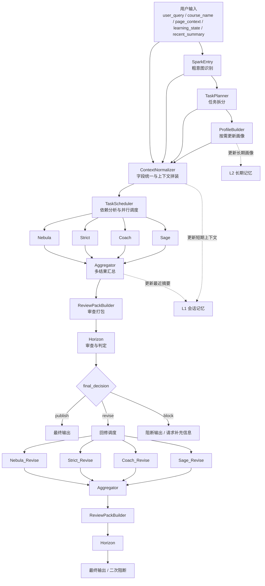
```mermaid
flowchart TD
    U["用户输入<br/>user_query / course_name / page_context / learning_state / recent_summary"] --> SE["SparkEntry<br/>粗意图识别"]
    SE --> TP["TaskPlanner<br/>任务拆分"]
    TP --> PB["ProfileBuilder<br/>按需更新画像"]
    PB --> CN["ContextNormalizer<br/>字段统一与上下文拼装"]
    TP --> CN
    SE --> CN
    U --> CN

    CN --> TS["TaskScheduler<br/>依赖分析与并行调度"]

    TS --> S1["Sage"]
    TS --> C1["Coach"]
    TS --> ST1["Strict"]
    TS --> N1["Nebula"]

    S1 --> AGG["Aggregator<br/>多结果汇总"]
    C1 --> AGG
    ST1 --> AGG
    N1 --> AGG

    AGG --> RPB["ReviewPackBuilder<br/>审查打包"]
    RPB --> HZ["Horizon<br/>审查与判定"]

    HZ --> DEC{"final_decision"}
    DEC -- "publish" --> OUT1["最终输出"]
    DEC -- "revise" --> REV["回修调度"]
    DEC -- "block" --> BLK["阻断输出 / 请求补充信息"]

    REV --> S2["Sage_Revise"]
    REV --> C2["Coach_Revise"]
    REV --> ST2["Strict_Revise"]
    REV --> N2["Nebula_Revise"]

    S2 --> AGG2["Aggregator"]
    C2 --> AGG2
    ST2 --> AGG2
    N2 --> AGG2

    AGG2 --> RPB2["ReviewPackBuilder"]
    RPB2 --> HZ2["Horizon"]
    HZ2 --> OUT2["最终输出 / 二次阻断"]

    PB -. 更新长期画像 .-> L2["L2 长期记忆"]
    CN -. 更新短期上下文 .-> L1["L1 会话记忆"]
    AGG -. 更新最近摘要 .-> L1
```

---

## 3. 总体状态机

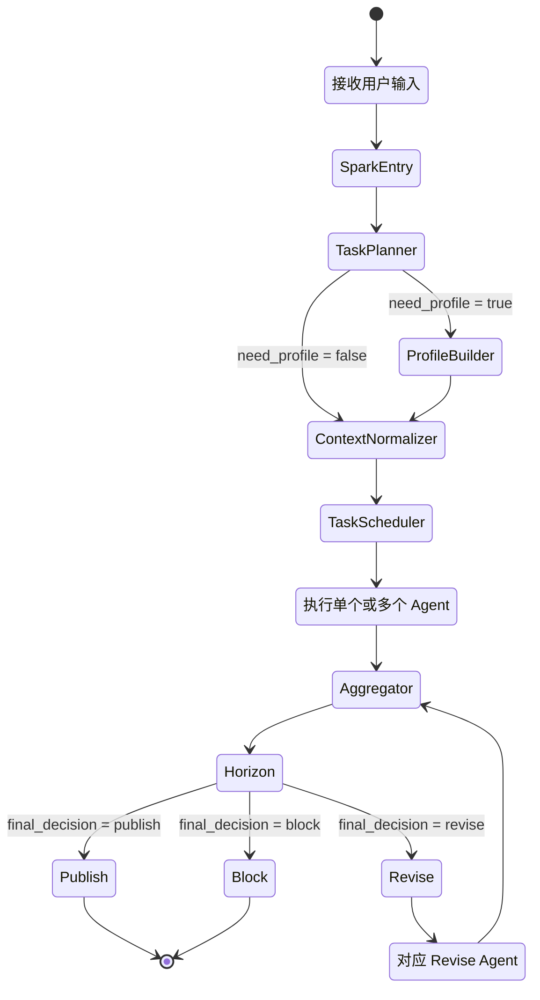
```mermaid
stateDiagram-v2
    [*] --> ReceiveInput
    ReceiveInput: 接收用户输入

    ReceiveInput --> RouteIntent
    RouteIntent: SparkEntry

    RouteIntent --> SplitTasks
    SplitTasks: TaskPlanner

    SplitTasks --> UpdateProfile: need_profile = true
    SplitTasks --> NormalizeContext: need_profile = false

    UpdateProfile: ProfileBuilder
    UpdateProfile --> NormalizeContext

    NormalizeContext: ContextNormalizer
    NormalizeContext --> ScheduleTasks
    ScheduleTasks: TaskScheduler

    ScheduleTasks --> RunAgents
    RunAgents: 执行单个或多个 Agent

    RunAgents --> Aggregate
    Aggregate: Aggregator

    Aggregate --> Review
    Review: Horizon

    Review --> Publish: final_decision = publish
    Review --> Revise: final_decision = revise
    Review --> Block: final_decision = block

    Revise --> RunRevisionAgents
    RunRevisionAgents: 对应 Revise Agent
    RunRevisionAgents --> Aggregate

    Publish --> [*]
    Block --> [*]
```

---

## 4. 节点职责分层图

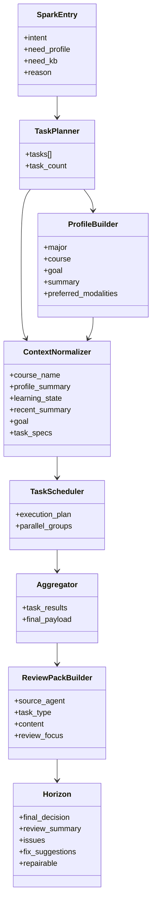
```mermaid
classDiagram
    class SparkEntry {
        +intent
        +need_profile
        +need_kb
        +reason
    }

    class TaskPlanner {
        +tasks[]
        +task_count
    }

    class ProfileBuilder {
        +major
        +course
        +goal
        +summary
        +preferred_modalities
    }

    class ContextNormalizer {
        +course_name
        +profile_summary
        +learning_state
        +recent_summary
        +goal
        +task_specs
    }

    class TaskScheduler {
        +execution_plan
        +parallel_groups
    }

    class Aggregator {
        +task_results
        +final_payload
    }

    class ReviewPackBuilder {
        +source_agent
        +task_type
        +content
        +review_focus
    }

    class Horizon {
        +final_decision
        +review_summary
        +issues
        +fix_suggestions
        +repairable
    }

    SparkEntry --> TaskPlanner
    TaskPlanner --> ProfileBuilder
    TaskPlanner --> ContextNormalizer
    ProfileBuilder --> ContextNormalizer
    ContextNormalizer --> TaskScheduler
    TaskScheduler --> Aggregator
    Aggregator --> ReviewPackBuilder
    ReviewPackBuilder --> Horizon
```

---

## 5. SparkEntry

意图识别

### 5.1 输入

- `user_query`
- `recent_summary`
- `profile_summary`
- `learning_state`
- `page_context`

### 5.2 输出

- `intent`
- `need_profile`
- `need_kb`
- `need_learning_state`
- `need_clarification`
- `clarification_question`
- `reason`

### 5.3 通信对象

- 下游发送给 `TaskPlanner`
- 辅助 `ContextNormalizer`

### 5.4 状态图

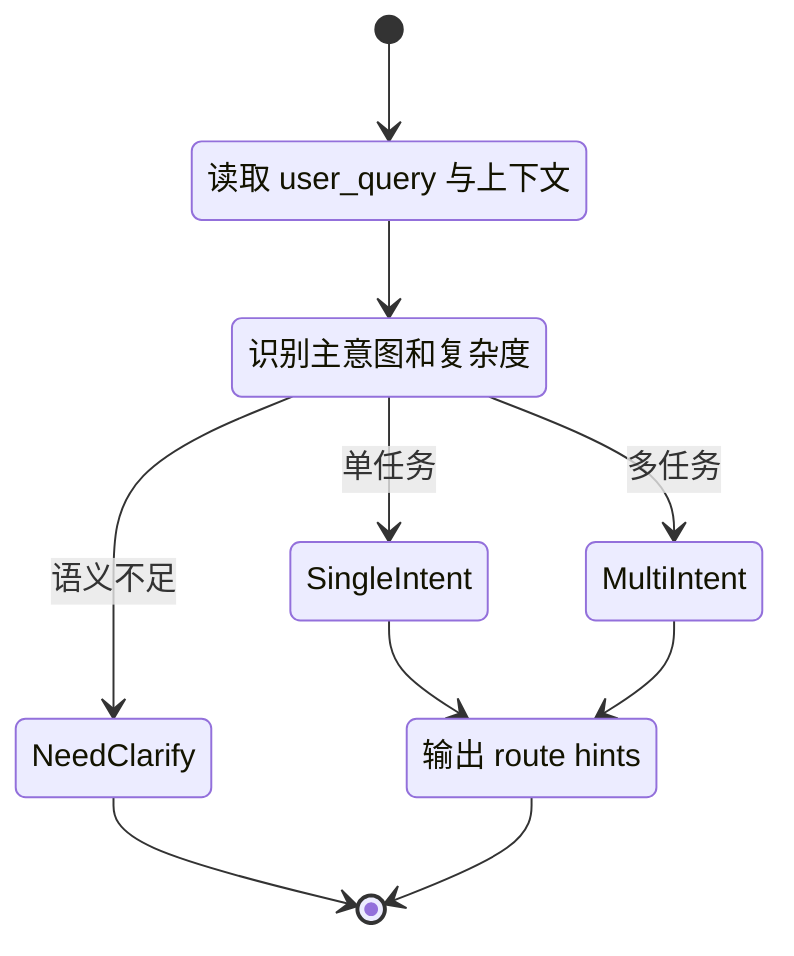
```mermaid
stateDiagram-v2
    [*] --> ParseQuery
    ParseQuery: 读取 user_query 与上下文

    ParseQuery --> DetectIntent
    DetectIntent: 识别主意图和复杂度

    DetectIntent --> SingleIntent: 单任务
    DetectIntent --> MultiIntent: 多任务
    DetectIntent --> NeedClarify: 语义不足

    NeedClarify --> [*]
    SingleIntent --> EmitRouteHints
    MultiIntent --> EmitRouteHints

    EmitRouteHints: 输出 route hints
    EmitRouteHints --> [*]
```

### 5.5 流程图

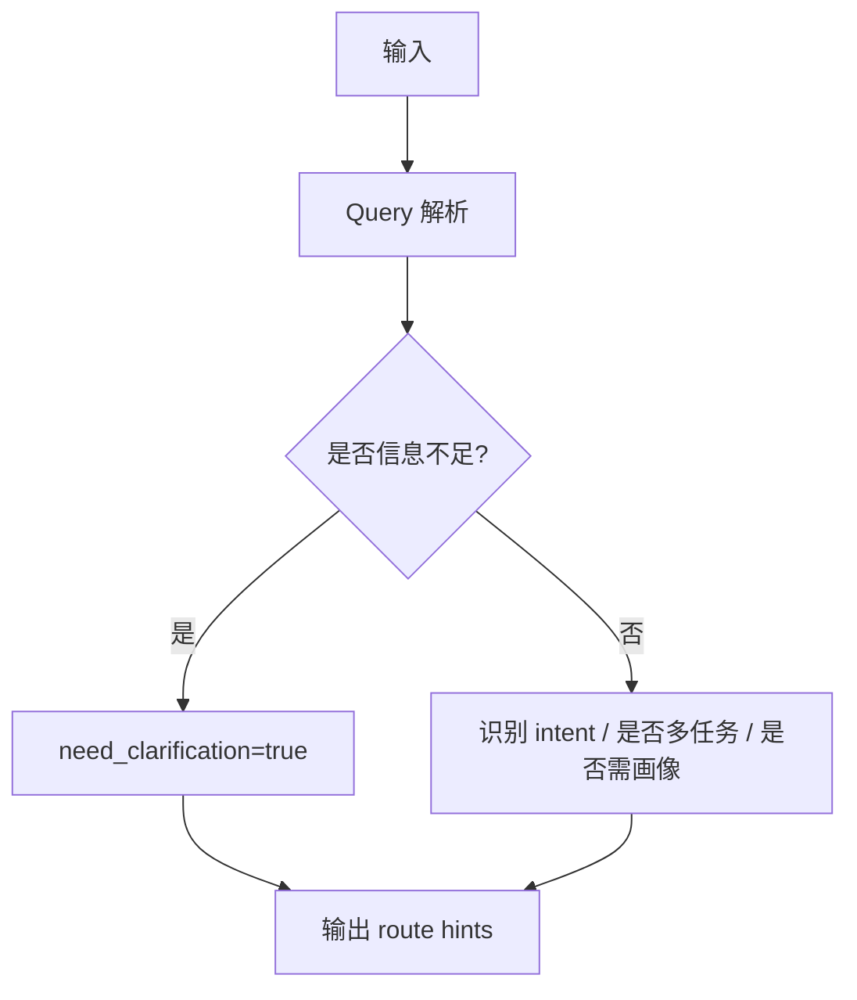
```mermaid
flowchart TD
    A["输入"] --> B["Query 解析"]
    B --> C{"是否信息不足?"}
    C -- "是" --> D["need_clarification=true"]
    C -- "否" --> E["识别 intent / 是否多任务 / 是否需画像"]
    D --> F["输出"]
    E --> F["输出 route hints"]
```

---

## 6. TaskPlanner

分析任务并进行计划

### 6.1 输入

- `user_query`
- `intent`
- `profile_summary`
- `learning_state`
- `recent_summary`
- `page_context`

### 6.2 输出

- `task_count`
- `tasks`

每个 `task` 建议包含：

- `task_id`
- `task_type`
- `target_agent`
- `task_goal`
- `priority`
- `depends_on`
- `raw_params`

### 6.3 通信对象

- 接收 `SparkEntry`
- 发送给 `ProfileBuilder`
- 发送给 `ContextNormalizer`
- 发送给 `TaskScheduler`

### 6.4 任务拆分图

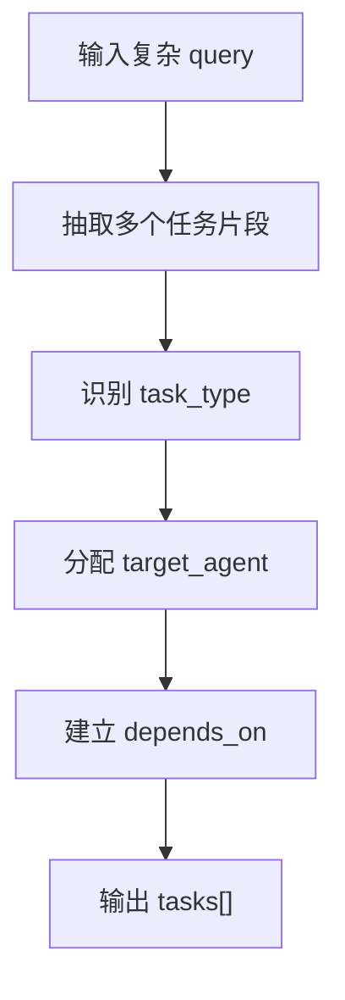
```mermaid
flowchart TD
    A["输入复杂 query"] --> B["抽取多个任务片段"]
    B --> C["识别 task_type"]
    C --> D["分配 target_agent"]
    D --> E["建立 depends_on"]
    E --> F["输出 tasks[]"]
```

### 6.5 任务对象结构图

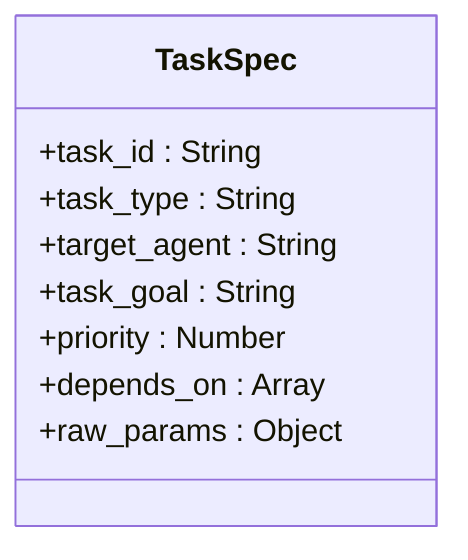
```mermaid
classDiagram
    class TaskSpec {
        +task_id : String
        +task_type : String
        +target_agent : String
        +task_goal : String
        +priority : Number
        +depends_on : Array
        +raw_params : Object
    }
```

---

## 7. ProfileBuilder

构建对应的用户画像

### 7.1 输入

- `user_query`
- `profile_summary`
- `recent_summary`
- `learning_state`
- `page_context`
- `tasks`

### 7.2 输出

- `major`
- `course`
- `goal`
- `current_level`
- `weak_points`
- `time_budget`
- `preferred_modalities`
- `cognitive_style`
- `motivation_state`
- `summary`

### 7.3 通信对象

- 接收 `TaskPlanner`
- 输出给 `ContextNormalizer`
- 更新 `L2 长期记忆`

### 7.4 状态图

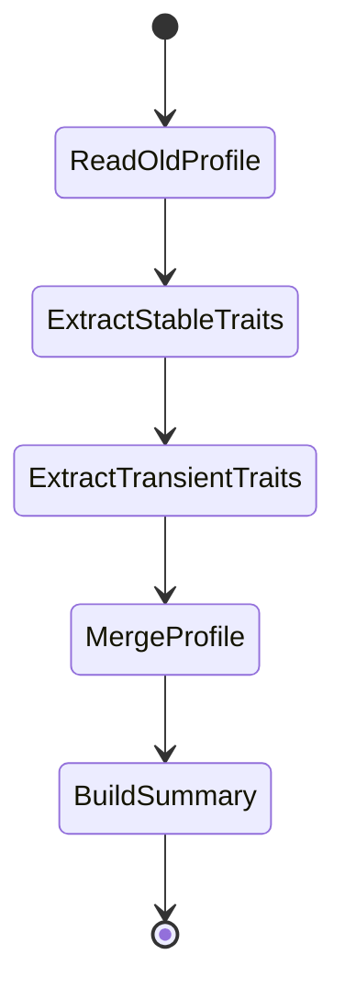
```mermaid
stateDiagram-v2
    [*] --> ReadOldProfile
    ReadOldProfile --> ExtractStableTraits
    ExtractStableTraits --> ExtractTransientTraits
    ExtractTransientTraits --> MergeProfile
    MergeProfile --> BuildSummary
    BuildSummary --> [*]
```

### 7.5 流程图

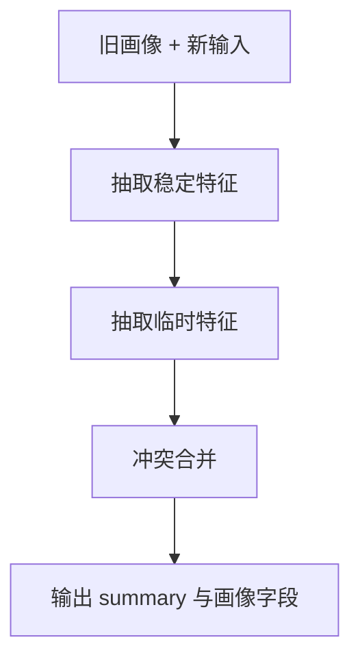
```mermaid
flowchart TD
    A["旧画像 + 新输入"] --> B["抽取稳定特征"]
    B --> C["抽取临时特征"]
    C --> D["冲突合并"]
    D --> E["输出 summary 与画像字段"]
```

---

## 8. ContextNormalizer

### 8.1 作用

负责统一字段命名、补齐上下文、把画像字段和任务字段合并成各 Agent 可直接消费的标准输入。

### 8.2 输入

- 来自 `开始` 节点的原始字段
- 来自 `SparkEntry` 的 route hints
- 来自 `TaskPlanner` 的 `tasks`
- 来自 `ProfileBuilder` 的画像输出

### 8.3 输出

- `course_name`
- `profile_summary`
- `learning_state`
- `recent_summary`
- `goal`
- `current_level`
- `weak_points`
- `preferred_modalities`
- `time_budget`
- `plan_duration_days`
- `exam_deadline`
- `normalized_tasks`

### 8.4 字段映射图

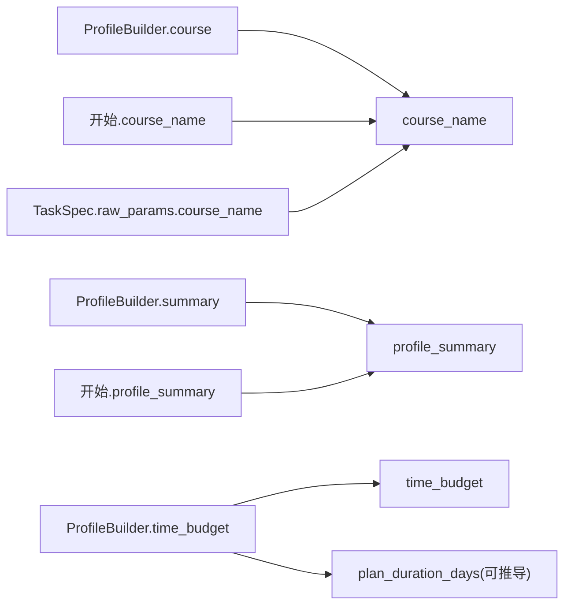
```mermaid
flowchart LR
    A["ProfileBuilder.course"] --> D["course_name"]
    B["开始.course_name"] --> D
    C["TaskSpec.raw_params.course_name"] --> D

    E["ProfileBuilder.summary"] --> F["profile_summary"]
    G["开始.profile_summary"] --> F

    H["ProfileBuilder.time_budget"] --> I["time_budget"]
    H --> J["plan_duration_days(可推导)"]
```

### 8.5 状态图

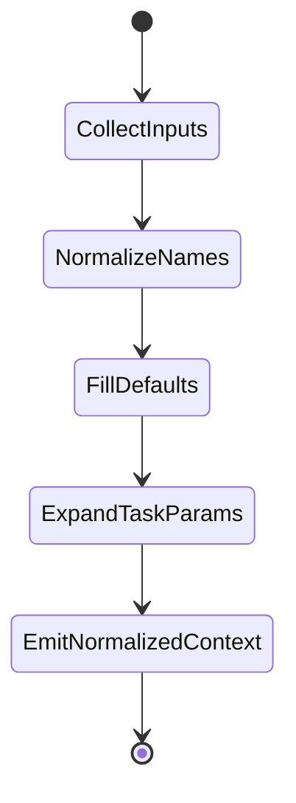
```mermaid
stateDiagram-v2
    [*] --> CollectInputs
    CollectInputs --> NormalizeNames
    NormalizeNames --> FillDefaults
    FillDefaults --> ExpandTaskParams
    ExpandTaskParams --> EmitNormalizedContext
    EmitNormalizedContext --> [*]
```

---

## 9. TaskScheduler

### 9.1 输入

- `normalized_tasks`

### 9.2 输出

- `execution_plan`
- `parallel_groups`

### 9.3 通信对象

- 接收 `ContextNormalizer`
- 调度 `Sage / Coach / Strict / Nebula`
- 输出给 `Aggregator`

### 9.4 调度图

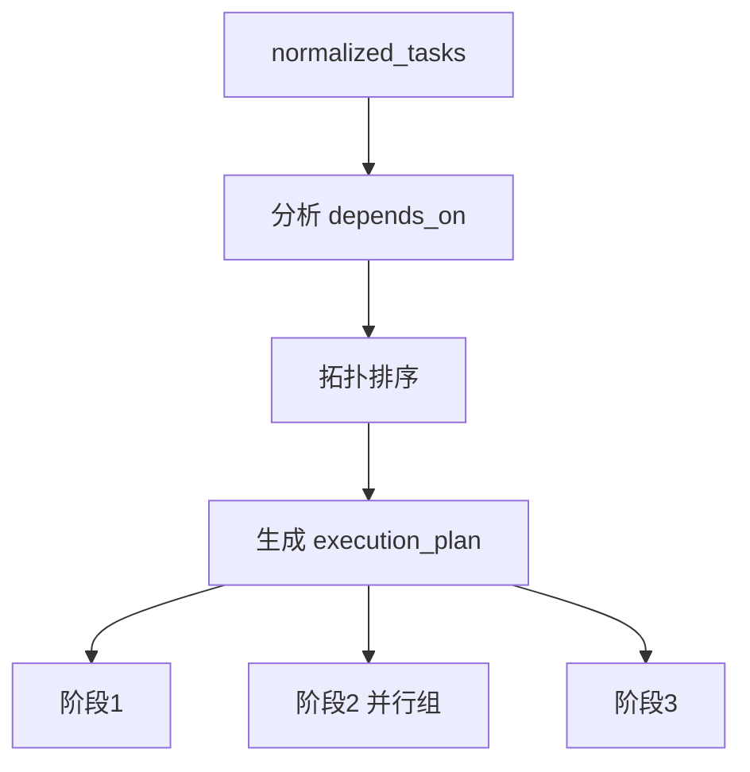
```mermaid
flowchart TD
    A["normalized_tasks"] --> B["分析 depends_on"]
    B --> C["拓扑排序"]
    C --> D["生成 execution_plan"]
    D --> E["阶段1"]
    D --> F["阶段2 并行组"]
    D --> G["阶段3"]
```

### 9.5 状态图

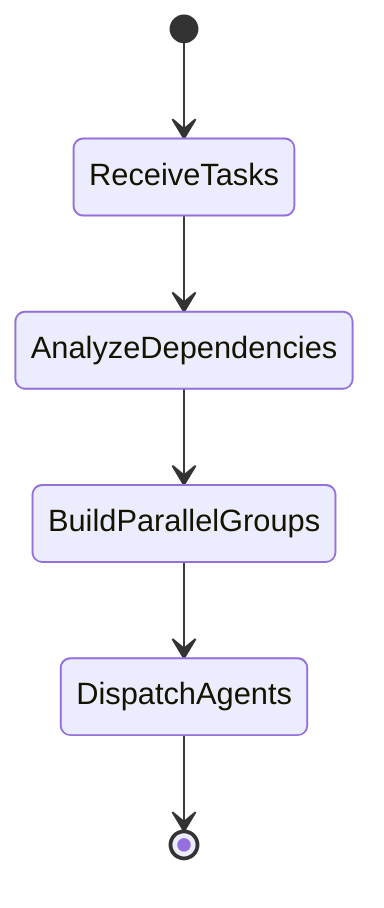
```mermaid
stateDiagram-v2
    [*] --> ReceiveTasks
    ReceiveTasks --> AnalyzeDependencies
    AnalyzeDependencies --> BuildParallelGroups
    BuildParallelGroups --> DispatchAgents
    DispatchAgents --> [*]
```

---

## 10. Sage

### 10.1 输入

- `task_id`
- `task_goal`
- `course_name`
- `knowledge_point`
- `answer_mode`
- `profile_summary`
- `learning_state`
- `recent_summary`
- `page_context`

### 10.2 输出

- `task_id`
- `intent_type`
- `answer_style`
- `core_answer`
- `layered_explanation`
- `example`
- `comparison`
- `knowledge_points`
- `citations`
- `next_step`
- `encouragement`
- `recommended_modalities`
- `primary_modality`
- `need_async_generation`
- `diagram_script`
- `video_reference`
- `audio_script`

### 10.3 通信对象

- 接收 `TaskScheduler`
- 发送给 `Aggregator`
- 回修时接收 `ReviewPackBuilder/Horizon` 的反馈

### 10.4 流程图

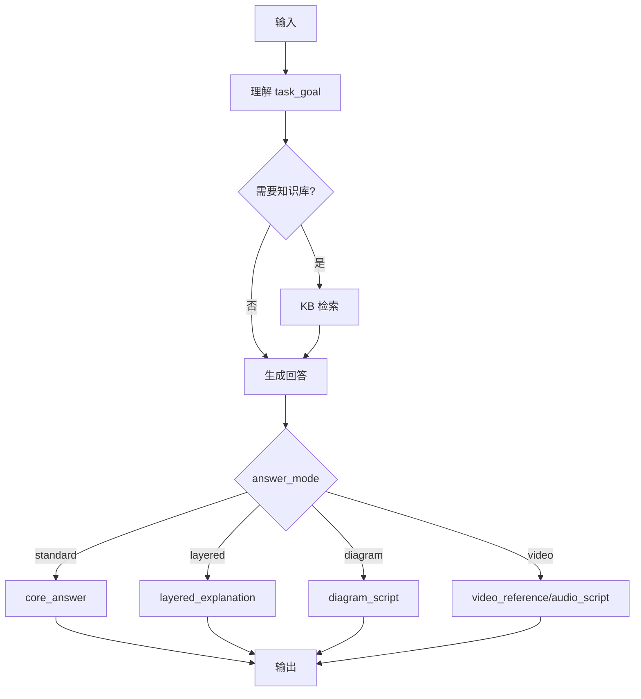
```mermaid
flowchart TD
    A["输入"] --> B["理解 task_goal"]
    B --> C{"需要知识库?"}
    C -- "是" --> D["KB 检索"]
    C -- "否" --> E["生成回答"]
    D --> E
    E --> F{"answer_mode"}
    F -- "standard" --> G["core_answer"]
    F -- "layered" --> H["layered_explanation"]
    F -- "diagram" --> I["diagram_script"]
    F -- "video" --> J["video_reference/audio_script"]
    G --> K["输出"]
    H --> K
    I --> K
    J --> K
```

### 10.5 状态图

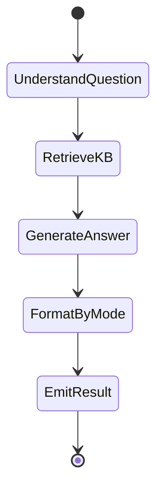
```mermaid
stateDiagram-v2
    [*] --> UnderstandQuestion
    UnderstandQuestion --> RetrieveKB
    RetrieveKB --> GenerateAnswer
    GenerateAnswer --> FormatByMode
    FormatByMode --> EmitResult
    EmitResult --> [*]
```

---

## 11. Coach

### 11.1 输入

- `task_id`
- `question_text`
- `student_answer`
- `student_request`
- `difficulty_level`
- `course_name`
- `knowledge_point`
- `profile_summary`
- `learning_state`
- `recent_summary`

### 11.2 输出

- `task_id`
- `error_type`
- `diagnosis`
- `hint_level_1`
- `hint_level_2`
- `full_explanation`
- `next_step`
- `knowledge_points`
- `encouragement`
- `intent_type`
- `recommended_modalities`
- `primary_modality`
- `need_async_generation`
- `diagram_script`
- `audio_script`
- `video_reference`

### 11.3 通信对象

- 接收 `TaskScheduler`
- 发送给 `Aggregator`
- 回修时接收审查反馈

### 11.4 流程图

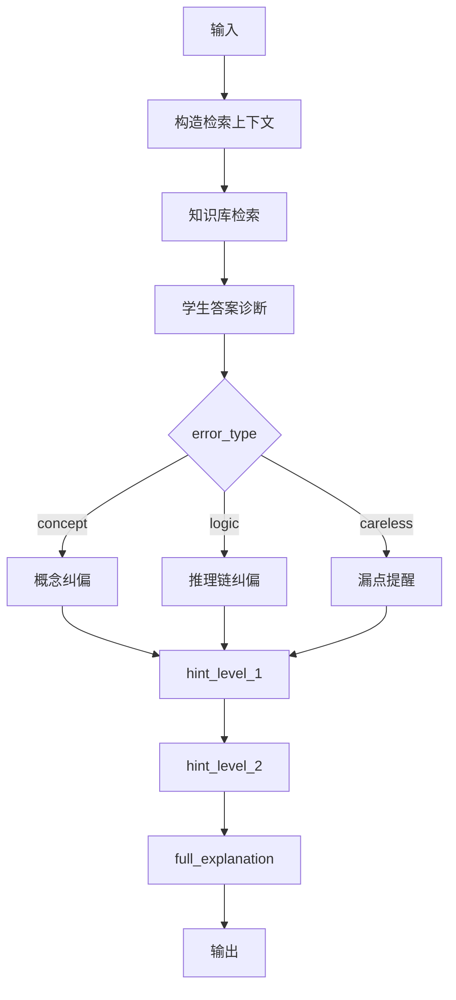
```mermaid
flowchart TD
    A["输入"] --> B["构造检索上下文"]
    B --> C["知识库检索"]
    C --> D["学生答案诊断"]
    D --> E{"error_type"}
    E -- "concept" --> F["概念纠偏"]
    E -- "logic" --> G["推理链纠偏"]
    E -- "careless" --> H["漏点提醒"]
    F --> I["hint_level_1"]
    G --> I
    H --> I
    I --> J["hint_level_2"]
    J --> K["full_explanation"]
    K --> L["输出"]
```

### 11.5 状态图

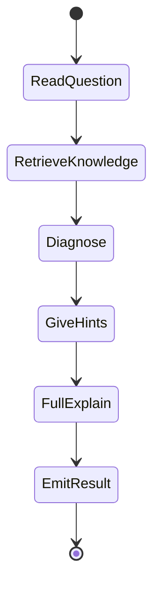
```mermaid
stateDiagram-v2
    [*] --> ReadQuestion
    ReadQuestion --> RetrieveKnowledge
    RetrieveKnowledge --> Diagnose
    Diagnose --> GiveHints
    GiveHints --> FullExplain
    FullExplain --> EmitResult
    EmitResult --> [*]
```

---

## 12. Strict

### 12.1 输入

- `task_id`
- `course_name`
- `goal`
- `time_budget`
- `plan_duration_days`
- `exam_deadline`
- `current_level`
- `weak_points`
- `preferred_modalities`
- `profile_summary`
- `learning_state`
- `recent_summary`

### 12.2 输出

- `task_id`
- `plan_title`
- `plan_summary`
- `duration_days`
- `overall_goal`
- `priority_topics`
- `daily_tasks`
- `recommended_resource_types`
- `checkpoints`
- `next_adjustment_rule`
- `encouragement`
- `recommended_modalities`
- `primary_modality`
- `need_async_generation`
- `resource_generation_brief`

### 12.3 通信对象

- 接收 `TaskScheduler`
- 发送给 `Aggregator`
- 可给 `Nebula` 提供 `resource_generation_brief`

### 12.4 流程图

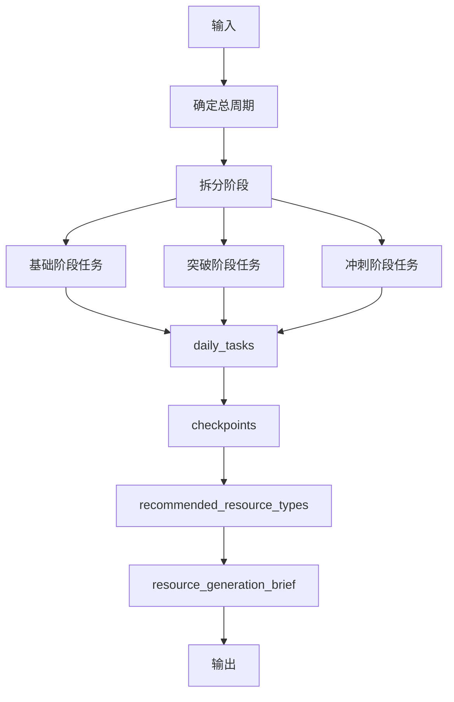
```mermaid
flowchart TD
    A["输入"] --> B["确定总周期"]
    B --> C["拆分阶段"]
    C --> D["基础阶段任务"]
    C --> E["突破阶段任务"]
    C --> F["冲刺阶段任务"]
    D --> G["daily_tasks"]
    E --> G
    F --> G
    G --> H["checkpoints"]
    H --> I["recommended_resource_types"]
    I --> J["resource_generation_brief"]
    J --> K["输出"]
```

### 12.5 状态图

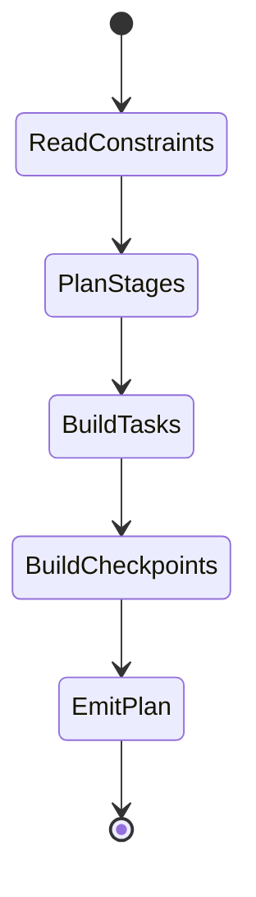
```mermaid
stateDiagram-v2
    [*] --> ReadConstraints
    ReadConstraints --> PlanStages
    PlanStages --> BuildTasks
    BuildTasks --> BuildCheckpoints
    BuildCheckpoints --> EmitPlan
    EmitPlan --> [*]
```

---

## 13. Nebula

### 13.1 输入

- `task_id`
- `course_name`
- `topic`
- `resource_types`
- `generation_brief`
- `goal`
- `current_level`
- `weak_points`
- `preferred_modalities`
- `profile_summary`
- `learning_state`

### 13.2 输出

- `task_id`
- `resource_pack_title`
- `target_topic`
- `target_level`
- `resource_types`
- `lecture_note`
- `mindmap_script`
- `diagram_script`
- `quiz`
- `code_lab`
- `ppt_outline`
- `video_script`
- `video_reference`
- `usage_suggestion`
- `recommended_modalities`
- `primary_modality`
- `need_async_generation`

### 13.3 通信对象

- 接收 `TaskScheduler`
- 接收 `Strict` 间接提供的 `resource_generation_brief`
- 发送给 `Aggregator`

### 13.4 流程图

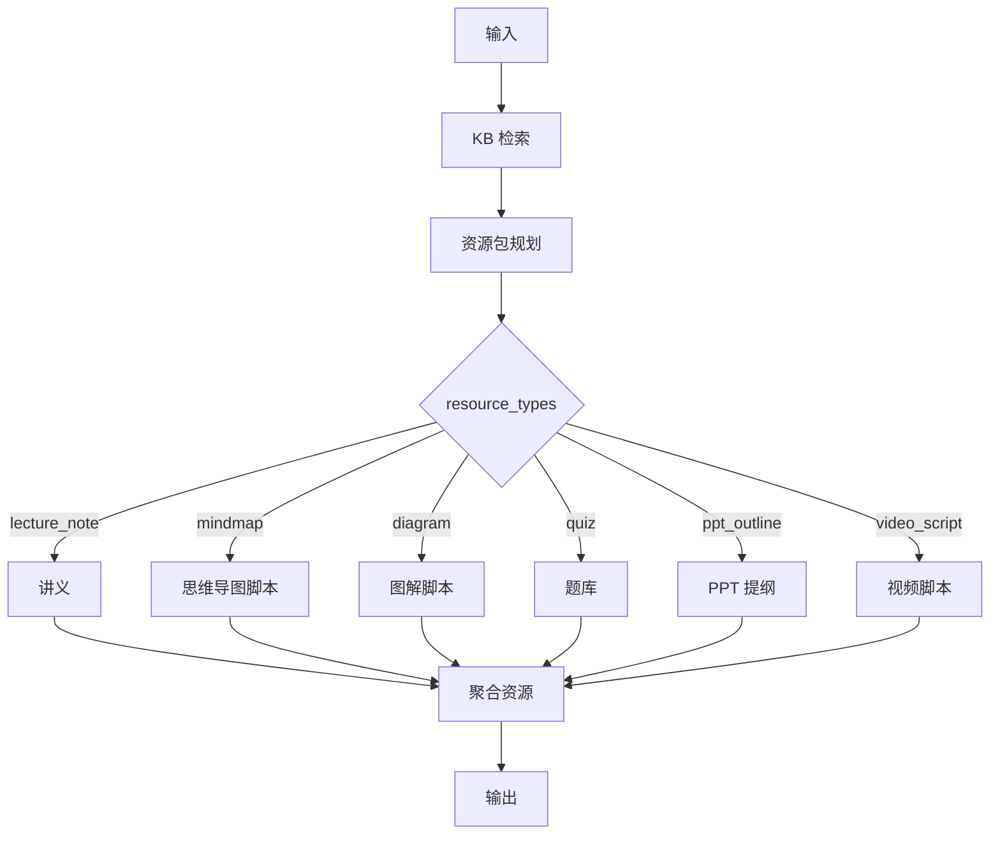
```mermaid
flowchart TD
    A["输入"] --> B["KB 检索"]
    B --> C["资源包规划"]
    C --> D{"resource_types"}
    D -- "lecture_note" --> E["讲义"]
    D -- "mindmap" --> F["思维导图脚本"]
    D -- "diagram" --> G["图解脚本"]
    D -- "quiz" --> H["题库"]
    D -- "ppt_outline" --> I["PPT 提纲"]
    D -- "video_script" --> J["视频脚本"]
    E --> K["聚合资源"]
    F --> K
    G --> K
    H --> K
    I --> K
    J --> K
    K --> L["输出"]
```

### 13.5 状态图

```mermaid
stateDiagram-v2
    [*] --> ReadBrief
    ReadBrief --> RetrieveKB
    RetrieveKB --> PlanResources
    PlanResources --> GenerateAssets
    GenerateAssets --> EmitPack
    EmitPack --> [*]
```

---

## 14. Aggregator

### 14.1 输入

- `task_results[]`

### 14.2 输出

- `task_results`
- `final_payload`
- `final_user_answer`

### 14.3 通信对象

- 接收 `Sage / Coach / Strict / Nebula`
- 发送给 `ReviewPackBuilder`
- 更新 `L1 recent_summary`

### 14.4 流程图

```mermaid
flowchart TD
    A["多个 Agent 结果"] --> B["按 task_id 汇总"]
    B --> C["按 priority 和依赖排序"]
    C --> D["生成 final_payload"]
    D --> E["生成 final_user_answer"]
    E --> F["输出给 ReviewPackBuilder"]
```

---

## 15. ReviewPackBuilder

### 15.1 输入

- `final_payload`
- `final_user_answer`
- `learning_state`
- `profile_summary`
- `task_results`

### 15.2 输出

- `source_agent`
- `task_type`
- `content`
- `learning_state`
- `profile_summary`
- `review_focus`
- `revision_count`

### 15.3 通信对象

- 接收 `Aggregator`
- 发送给 `Horizon`
- 回修时给各 `*_Revise` 节点提供反馈输入

### 15.4 组装逻辑图

```mermaid
flowchart TD
    A["task_results"] --> B["判断 single_task / multi_task"]
    B --> C["生成 source_agent"]
    B --> D["生成 task_type"]
    B --> E["组装 content"]
    B --> F["生成 review_focus"]
    C --> G["输出审查包"]
    D --> G
    E --> G
    F --> G
```

---

## 16. Horizon

### 16.1 输入

- `source_agent`
- `task_type`
- `content`
- `learning_state`
- `profile_summary`
- `review_focus`
- `revision_count`

### 16.2 输出

- `final_decision`
- `review_summary`
- `issues`
- `fix_suggestions`
- `risk_level`
- `repairable`
- `retry_same_agent`
- `target_revision_agent`

### 16.3 通信对象

- 接收 `ReviewPackBuilder`
- 输出到最终结果分支
- 输出到回修调度分支

### 16.4 流程图

```mermaid
flowchart TD
    A["输入审查包"] --> B["事实性检查"]
    B --> C["教学适配性检查"]
    C --> D["结构完整性检查"]
    D --> E["安全与幻觉检查"]
    E --> F{"final_decision"}
    F -- "publish" --> G["通过"]
    F -- "revise" --> H["回修建议"]
    F -- "block" --> I["阻断 / 补充信息"]
```

### 16.5 状态图

```mermaid
stateDiagram-v2
    [*] --> ReadPack
    ReadPack --> FactualCheck
    FactualCheck --> PedagogyCheck
    PedagogyCheck --> StructureCheck
    StructureCheck --> SafetyCheck
    SafetyCheck --> Publish
    SafetyCheck --> Revise
    SafetyCheck --> Block
    Publish --> [*]
    Revise --> [*]
    Block --> [*]
```

---

## 17. 回修闭环图

```mermaid
flowchart TD
    A["原 Agent 输出"] --> B["ReviewPackBuilder"]
    B --> C["Horizon"]
    C --> D{"final_decision"}
    D -- "publish" --> E["直接返回"]
    D -- "revise" --> F["对应 Revise Agent"]
    D -- "block + repairable=true" --> F
    D -- "block + repairable=false" --> G["阻断返回"]
    F --> H["修订结果"]
    H --> B
```

---

## 18. 多 Agent 协作时序图

```mermaid
sequenceDiagram
    participant U as 用户
    participant SE as SparkEntry
    participant TP as TaskPlanner
    participant PB as ProfileBuilder
    participant CN as ContextNormalizer
    participant TS as TaskScheduler
    participant AG as Agents
    participant AGG as Aggregator
    participant RPB as ReviewPackBuilder
    participant HZ as Horizon
    participant MEM as 记忆系统

    U->>SE: 输入 query + 上下文
    SE->>TP: route hints
    TP->>PB: tasks + 是否需画像
    PB-->>CN: profile fields
    TP-->>CN: task specs
    U-->>CN: 原始输入字段
    CN->>TS: normalized_tasks
    TS->>AG: 调度一个或多个 agent
    AG-->>AGG: task_results
    AGG->>RPB: final_payload
    RPB->>HZ: content + source_agent + task_type
    HZ-->>U: publish / revise / block
    PB-->>MEM: 更新 L2
    AGG-->>MEM: 更新 L1 与 recent_summary
```

---

## 19. 双层记忆架构图

```mermaid
classDiagram
    class MemorySystem {
        +L1SessionMemory
        +L2ProfileMemory
        +SummaryEngine
        +RecallPolicy
    }

    class L1SessionMemory {
        +recent_summary
        +page_context
        +current_topic
        +last_outputs
        +task_stack
        +ttl_short
    }

    class L2ProfileMemory {
        +major
        +course
        +goal
        +current_level
        +weak_points
        +preferred_modalities
        +cognitive_style
        +motivation_state
        +profile_summary
        +ttl_long
    }

    class SummaryEngine {
        +build_recent_summary()
        +build_profile_summary()
        +compress_context()
    }

    class RecallPolicy {
        +read_L1_for_turn()
        +read_L2_for_personalization()
        +decide_profile_refresh()
    }

    MemorySystem --> L1SessionMemory
    MemorySystem --> L2ProfileMemory
    MemorySystem --> SummaryEngine
    MemorySystem --> RecallPolicy
```

---

## 20. 双层记忆工作规则

### 20.1 L1 会话记忆

保存：

- 最近问题主题
- 当前任务栈
- 最近一轮或几轮结果摘要
- 当前页面上下文
- 当前学习状态变化

特点：

- 更新频率高
- 生命周期短
- 为当前连续对话服务

### 20.2 L2 长期画像记忆

保存：

- 专业
- 长期课程
- 长期目标
- 水平判断
- 薄弱点
- 偏好模态
- 认知风格
- 动机状态

特点：

- 更新频率低
- 生命周期长
- 为个性化服务

### 20.3 更新规则

```mermaid
flowchart TD
    A["每轮对话结束"] --> B["提取稳定信息?"]
    B -- "是" --> C["更新 L2"]
    B -- "否" --> D["仅更新 L1"]
    C --> E["重算 profile_summary"]
    D --> F["重算 recent_summary"]
    E --> G["下轮召回"]
    F --> G
```

### 20.4 召回规则

```mermaid
stateDiagram-v2
    [*] --> NewTurn
    NewTurn --> ReadL1
    ReadL1 --> ReadL2
    ReadL2 --> BuildContext
    BuildContext --> RunAgents
    RunAgents --> UpdateL1
    UpdateL1 --> CheckStableTraits
    CheckStableTraits --> UpdateL2: 有新稳定特征
    CheckStableTraits --> EndTurn: 无
    UpdateL2 --> EndTurn
    EndTurn --> [*]
```

---

## 21. 统一通信协议建议

### 21.1 TaskPlanner 输出协议

```json
{
  "task_count": 2,
  "tasks": [
    {
      "task_id": "t1",
      "task_type": "qa",
      "target_agent": "sage",
      "task_goal": "解释虚拟内存",
      "priority": 1,
      "depends_on": [],
      "raw_params": {}
    }
  ]
}
```

### 21.2 Agent 标准输出协议

```json
{
  "task_id": "t1",
  "source_agent": "sage",
  "task_type": "qa",
  "payload": {},
  "status": "ok"
}
```

### 21.3 审查输出协议

```json
{
  "final_decision": "publish",
  "review_summary": "",
  "issues": [],
  "fix_suggestions": [],
  "repairable": false,
  "retry_same_agent": false,
  "target_revision_agent": ""
}
```

---

## 22. 建议落地顺序

1. 先补 `TaskPlanner`
2. 再补 `ContextNormalizer`
3. 再补 `TaskScheduler`
4. 再补 `Aggregator`
5. 然后把 `ReviewPackBuilder + Horizon + Revise 闭环` 接完整
6. 最后再把双层记忆接入 `ProfileBuilder / Aggregator`

---

## 23. 结论

这份文档可以直接作为：

- 系统设计说明书底稿
- 比赛答辩架构图底稿
- Coze 主工作流搭建蓝图
- 多 Agent 协作规范说明

使用。

