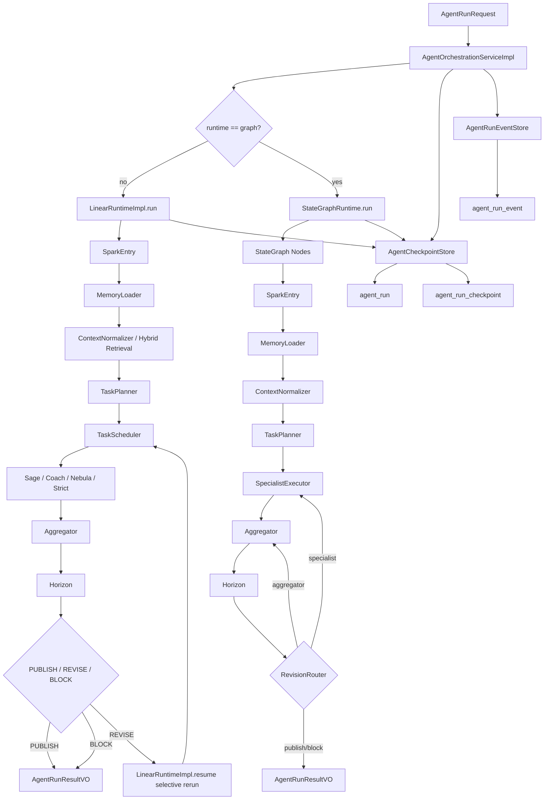
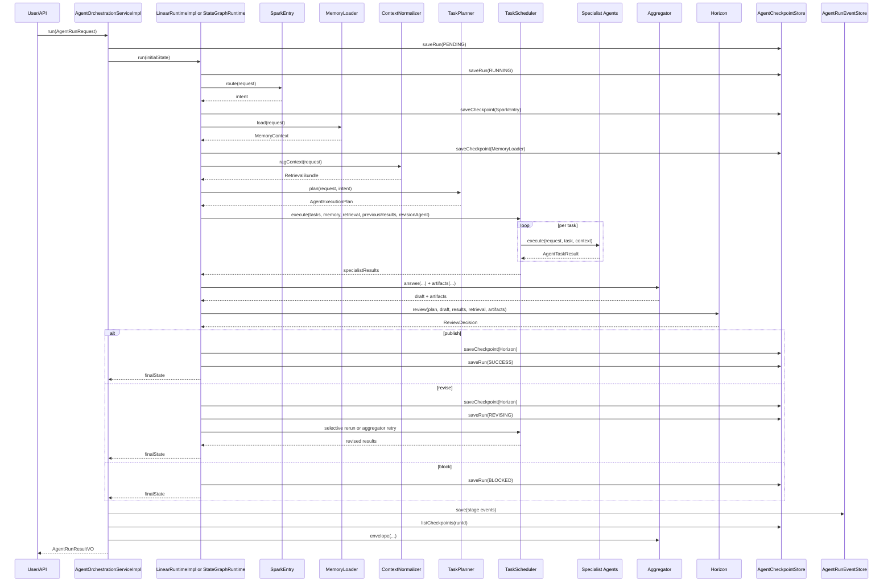

# 当前多 Agent 运行时分析

本文档只描述当前仓库中的真实代码行为，不描述目标蓝图，不把未来规划当成现状。

适用代码范围：

- `arch/arch-agent`
- `arch/arch-manage` 中的 agent run 查询 / resume / replay 管理接口

---

## 1. 先给结论

当前这套 agent **不是**“完全自治、自由 handoff 的 open-ended multi-agent system”，而是：

1. **中心调度型 agentic workflow**
2. 由 `AgentOrchestrationServiceImpl` 统一收口
3. 由 `LinearRuntimeImpl` 执行真实业务主链
4. 由 `StateGraphRuntime` 提供图式节点、checkpoint、resume、revision routing
5. 专家 agent 不是彼此自由对话，而是受 `TaskPlanner + TaskScheduler` 控制

所以它的真实范式更准确地说是：

> **Supervisor-oriented agentic workflow with controlled specialist execution, DAG-like task planning, checkpointed state graph shell, and review-driven selective revision**

中文可以理解为：

> **中心调度的多 Agent 工作流**，带有受控专家执行、依赖任务编排、checkpoint 持久化、审核回修和恢复能力。

---

## 2. 它到底是一条链，还是 supervisor，还是状态图

当前代码里三者都存在，但主次要分清楚。

### 2.1 它不是单纯的一条链

如果只是“一条链”，意味着：

- 入口
- 一路串行
- 没有任务分解
- 没有专家协作
- 没有回修

当前不是这样。因为已经有：

- `TaskPlanner` 拆任务
- `TaskScheduler` 选专家
- `Horizon` 决定 `PUBLISH / REVISE / BLOCK`
- `RevisionRouter` 决定回哪里修

所以它已经超出单链。

### 2.2 它本质上是中心调度 supervisor 模型

最核心的调度中心是：

- `AgentOrchestrationServiceImpl`
- `LinearRuntimeImpl`
- `TaskPlanner`
- `TaskScheduler`

专家 agent：

- `SageAgent`
- `CoachAgent`
- `NebulaAgent`
- `StrictAgent`

这些专家之间**没有直接互相调用**，也没有自由 handoff。它们只会：

- 接收 scheduler 分配的任务
- 基于统一上下文执行
- 返回结构化结果

所以这是：

> **Supervisor + controlled specialist execution**

而不是完全去中心化的 handoff agent。

### 2.3 它也有循环状态图，但图壳重于节点内业务

`StateGraphRuntime` 已经接入 LangGraph4j，定义了真实节点：

- `SparkEntry`
- `MemoryLoader`
- `ContextNormalizer`
- `TaskPlanner`
- `SpecialistExecutor`
- `Aggregator`
- `Horizon`
- `RevisionRouter`

并且存在回环：

- `Horizon -> RevisionRouter`
- `RevisionRouter -> SpecialistExecutor`
- `RevisionRouter -> Aggregator`

这说明它已经是**循环状态图**。

但当前要注意：

- 图节点已存在
- checkpoint 已存在
- resume 已存在
- 条件路由已存在

但是节点内部实际业务执行仍主要依赖 `LinearRuntimeImpl`，尤其 revision 路径仍回到 `linearRuntime.resume(...)`。

所以当前最准确的说法是：

> **真实运行模式 = 线性业务执行器 + 图式调度壳**

而不是“每个节点都是独立业务 patch 的纯图执行器”。

---

## 3. 推理范式是什么

当前并不是“单模型自己思考到底”的长链式 CoT 外露系统，而是**任务分解式推理**。

它的推理范式更接近下面这个流程：

1. 识别意图
2. 加载记忆
3. 构造混合检索上下文
4. 根据意图做任务规划
5. 由不同专家分别处理不同子任务
6. 聚合子结果
7. 审核是否满足输出约束
8. 不满足时定向回修

所以它更像：

- **Plan-and-execute**
- **Retrieve-and-reason**
- **Review-and-revise**

三者的组合。

### 3.1 不是纯 reactive agent

Reactive agent 往往是：

- 看一步
- 调一个工具
- 再看一步

当前这套不是这种范式。因为它先有显式 `plan`，再执行专家任务。

### 3.2 不是完全 ReAct

虽然有工具和检索，但当前不是让模型自由地“Thought/Action/Observation”无限循环。

工具主要还是：

- 编排层控制
- 检索层控制
- 专家有限使用

所以更像：

> **Workflow-first reasoning with controlled retrieval and specialist execution**

### 3.3 是教育导向的结构化推理

从任务分配上看：

- 问答 -> `Sage`
- 解题 -> `Coach -> Sage`
- 图解 -> `Nebula -> Sage`
- 学习计划 -> `Strict`
- graph 模式 -> `Nebula -> Coach -> Sage`

这意味着当前推理已经明显偏教育场景，不是通用开放域 agent。

---

## 4. 当前是否能区分“打招呼 / 问答 / 训练 / 图任务”

### 4.1 当前已经能区分一部分，但仍然是粗粒度

当前分类入口在：

- [`SparkEntry.java`](E:/hoppeAndSpark/hoppeAndSpark/arch/arch-agent/src/main/java/com/hopeandsparks/agent/orchestration/SparkEntry.java)

规则来源：

- `request.agentMode()`
- `request.userQuery()` 中的关键词

当前可区分：

- `DIAGRAM`
- `STEPS`
- `RAG`
- `GRAPH`
- `PLAN`
- 默认 `QA`

### 4.2 还不能真正识别“寒暄/闲聊”

比如：

- “你好”
- “早上好”
- “在吗”

当前 `SparkEntry` 没有专门的 `CHAT/GREETING` 意图。

这类请求最后会落到默认：

- `QA`
- 由 `SageAgent` 回答

所以：

- **能工作**
- **但不是显式分类**

### 4.3 “训练”也没有单独意图

如果“训练”指：

- 出题
- 批改
- 连续练习
- 按知识点生成训练任务

当前没有独立 `TRAINING` / `PRACTICE` intent。

现在只能通过：

- `steps`
- `plan`
- `graph`
- `qa`

去近似承载。

所以当前结论是：

| 类型 | 当前是否显式支持 |
|---|---|
| 打招呼/闲聊 | 否，落入 QA |
| 普通问答 | 是 |
| 解题步骤 | 是 |
| 知识库问答 | 是 |
| 图解任务 | 是 |
| 学习计划 | 是 |
| 训练型任务 | 否，只有近似承载 |

---

## 5. 当前能否根据需求选择文字回答、图片生成、视频链接检索

### 5.1 文字回答：能

这是当前最成熟的能力。

路径：

- `SageAgent`
- `CoachAgent`
- `StrictAgent`
- `Aggregator`

最终会产出：

- `finalAnswer`
- `answerSummary`
- `stepList`
- `learningPlan`

### 5.2 Mermaid 图片：能，但不是通用图片生成

当前 `NebulaAgent` 支持：

- 生成 Mermaid 脚本
- 在 `renderMermaid=true` 时调用 `mermaid_render`
- 返回 `diagramImagePath`

这属于：

- **结构图渲染**
- **不是文生图**

也就是说当前并没有：

- Stable Diffusion
- 图像生成模型
- 海报/插图/场景图生成

当前图像能力仅限：

- Mermaid 图 -> PNG/SVG

### 5.3 视频链接检索：当前没有专门能力

你提到：

- 用关键词找 B 站视频
- 或其他平台视频链接

当前真实代码里：

- `HybridRetrievalOrchestrator` 会做 web search
- 但它是通用 Web 搜索
- 没有平台定向策略
- 没有专门的“视频搜索 agent/tool”
- 没有 `bilibili_search` / `youtube_search` / `resource_recommendation` 之类工具

所以当前状态是：

- **理论上可能通过通用 Web 搜索命中视频页**
- **但没有显式的平台检索工作流**
- **不会主动按“视频资源优先”输出**

### 5.4 当前输出类型选择能力总结

| 输出类型 | 当前状态 |
|---|---|
| 纯文字回答 | 已支持 |
| 解题步骤 | 已支持 |
| 学习计划 | 已支持 |
| Mermaid 文本脚本 | 已支持 |
| Mermaid 图片 | 已支持 |
| 通用 AI 图片生成 | 未支持 |
| 平台化视频链接检索 | 未支持 |
| “按需求自动决定视频优先输出” | 未支持 |

---

## 6. 当前真实运行时的 Mermaid 架构图



---

## 7. 当前真实代码对应的时序图



---

## 8. 按类逐个讲源码职责与调用关系

下面按你指定的顺序讲。

---

## 8.1 AgentOrchestrationServiceImpl

文件：

- [`AgentOrchestrationServiceImpl.java`](E:/hoppeAndSpark/hoppeAndSpark/arch/arch-agent/src/main/java/com/hopeandsparks/agent/service/impl/AgentOrchestrationServiceImpl.java)

### 8.1.1 它的职责

这是最外层总入口，职责是：

1. 接收 `AgentRunRequest`
2. 构造初始 `AgentGraphState`
3. 根据配置选择 runtime
4. 调用 `graphRuntime.run(...)` 或 `linearRuntime.run(...)`
5. 执行完后：
   - 持久化 memory update
   - 生成 stage events
   - 生成 `FinalAnswerEnvelope`
   - 读取 checkpoint 列表
   - 返回 `AgentRunResultVO`

### 8.1.2 它是不是 supervisor

它是**系统级 supervisor 入口**，但不直接决定专家顺序。  
真正的专家调度发生在：

- `TaskPlanner`
- `TaskScheduler`

所以它更像：

- 运行会话的总控制器
- 不是细粒度任务调度器

### 8.1.3 它和其他类怎么协作

它调用：

- `LinearRuntime`
- `GraphRuntime`
- `AgentMemoryService`
- `AgentCheckpointStore`
- `AgentRunEventStore`
- `Aggregator`
- `ToolRegistry`

关系是：

```text
AgentOrchestrationServiceImpl
  -> runtime.run/resume
  -> memory.persist
  -> eventStore.save
  -> checkpointStore.listCheckpoints
  -> aggregator.envelope
  -> build AgentRunResultVO
```

### 8.1.4 它不做什么

它不直接做：

- 意图识别
- 检索
- 专家选择
- LLM 调用
- Mermaid 渲染

这些都被下沉了。

---

## 8.2 LinearRuntimeImpl

文件：

- [`LinearRuntimeImpl.java`](E:/hoppeAndSpark/hoppeAndSpark/arch/arch-agent/src/main/java/com/hopeandsparks/agent/runtime/impl/LinearRuntimeImpl.java)

### 8.2.1 它的职责

它是当前**最真实的业务执行主链**。

执行顺序固定：

1. `SparkEntry.route`
2. `MemoryLoader.load`
3. `ContextNormalizer.ragContext`
4. `TaskPlanner.plan`
5. `TaskScheduler.execute`
6. `Aggregator.answer`
7. `Aggregator.artifacts`
8. `Horizon.review`
9. 更新状态并持久化 checkpoint / run

### 8.2.2 它是当前真正的业务引擎

虽然系统支持 `StateGraphRuntime`，但当前业务上最完整的执行逻辑仍然在 `LinearRuntimeImpl.execute(...)`。

特别是：

- 实际 plan 使用
- 实际 specialist 执行
- 实际 review
- 实际 final state 生成

都在这里最完整。

### 8.2.3 它怎么支持 revision

`resume(...)` 最终也是回到 `execute(..., true)`。

这里通过：

- `initialState.specialistResults()`
- `initialState.review().targetRevisionAgent()`

把 revision 信息传给 `TaskScheduler`，实现选择性重跑。

### 8.2.4 它和其他类的关系

```text
LinearRuntimeImpl
  -> SparkEntry
  -> MemoryLoader
  -> ContextNormalizer
  -> TaskPlanner
  -> TaskScheduler
  -> Aggregator
  -> Horizon
  -> AgentCheckpointStore
```

所以 `LinearRuntimeImpl` 是：

> **当前业务执行的 spine**

---

## 8.3 StateGraphRuntime

文件：

- [`StateGraphRuntime.java`](E:/hoppeAndSpark/hoppeAndSpark/arch/arch-agent/src/main/java/com/hopeandsparks/agent/runtime/impl/StateGraphRuntime.java)

### 8.3.1 它的职责

它负责：

1. 编译 LangGraph4j `StateGraph`
2. 定义节点与边
3. 定义 `Horizon` 后的条件路由
4. 支持 checkpoint 恢复
5. 支持 `runId` / `checkpointId` resume

### 8.3.2 它当前是“图式调度壳”

它已经定义了这些节点：

- `SparkEntry`
- `MemoryLoader`
- `ContextNormalizer`
- `TaskPlanner`
- `SpecialistExecutor`
- `Aggregator`
- `Horizon`
- `RevisionRouter`

但当前节点 body 主要做的是：

- `advanceNodeState`
- `saveCheckpoint`

revision 真正落回业务执行时，会调用：

- `linearRuntime.resume(state)`

所以它的真实角色是：

- 提供状态图结构
- 提供 checkpoint
- 提供恢复
- 提供 revision routing

而不是每个节点都自己执行业务逻辑。

### 8.3.3 它和 LinearRuntimeImpl 的关系

关系不是替代，而是：

- `StateGraphRuntime` 管调度/状态/恢复
- `LinearRuntimeImpl` 管真实业务执行

这是当前最重要的一点。

### 8.3.4 它的回修路线

`Horizon` 结果为 `REVISE` 后：

- 如果目标是 `SPECIALIST` -> 回 `SpecialistExecutor`
- 如果目标是 `AGGREGATOR` -> 回 `Aggregator`
- 否则终止

但实际重跑动作最终仍由 `linearRuntime.resume(...)` 完成。

---

## 8.4 TaskPlanner

文件：

- [`TaskPlanner.java`](E:/hoppeAndSpark/hoppeAndSpark/arch/arch-agent/src/main/java/com/hopeandsparks/agent/orchestration/TaskPlanner.java)

### 8.4.1 它的职责

它负责把：

- `intent`
- `request`

转成：

- `AgentExecutionPlan`
- `List<AgentTask>`

### 8.4.2 它是静态规则规划，不是 LLM planner

当前它不是模型生成计划，而是**代码规则规划器**。

例如：

- `DIAGRAM` -> `NEBULA -> SAGE`
- `STEPS` -> `COACH -> SAGE`
- `PLAN` -> `STRICT`
- `GRAPH` -> `NEBULA -> COACH -> SAGE`

### 8.4.3 它决定了哪些 agent 会参与

当前参与哪些 agent，不是运行时即兴决定，而是这里决定。

所以 TaskPlanner 是：

> **专家参与范围和依赖关系的定义点**

### 8.4.4 它输出的关键东西

- `mustProduce`
- `requiresDiagram`
- `requiresRag`
- `outputMode`
- 每个任务的 `dependsOn`

后面的 `Horizon` 和 `TaskScheduler` 都依赖这些信息。

---

## 8.5 TaskScheduler

文件：

- [`TaskScheduler.java`](E:/hoppeAndSpark/hoppeAndSpark/arch/arch-agent/src/main/java/com/hopeandsparks/agent/orchestration/TaskScheduler.java)

### 8.5.1 它的职责

它负责真正执行 `AgentTask`。

流程：

1. 把所有 `SpecialistAgent` 注册到 `Map<AgentName, SpecialistAgent>`
2. 遍历 task list
3. 检查依赖是否满足
4. 构造统一 context
5. 调用目标专家的 `execute(...)`
6. 收集结果

### 8.5.2 它是当前真正的 specialist 调度器

`TaskPlanner` 决定“做什么”，`TaskScheduler` 决定“谁现在执行”。

### 8.5.3 它怎么支持 revision

如果存在 `revisionAgent`：

- 不是目标 agent 的任务
- 且历史中已有结果

那么直接复用旧结果，不重跑。

这就是当前“受控 selective rerun”的核心实现。

### 8.5.4 它构造给专家的 context

当前包含：

- `memory`
- `retrieval`
- `priorResults`
- `historyByAgent`

所以专家拿到的不是裸问题，而是整合后的上下文。

---

## 8.6 各专家 Agent

### 8.6.1 SageAgent

文件：

- [`SageAgent.java`](E:/hoppeAndSpark/hoppeAndSpark/arch/arch-agent/src/main/java/com/hopeandsparks/agent/agent/SageAgent.java)

职责：

- 概念解释
- 主回答
- 基于 retrieval 的回答
- 引用输出

输入：

- `userQuery`
- `memory`
- `retrieval.citations`
- `retrieval.candidateIds`
- `retrieval.qualityFlags`

输出：

- `answerText`
- `structuredPayload.summary`
- `structuredPayload.citations`
- `issues` 中可能有 `missing_citations`

它是当前默认主回答 agent。

---

### 8.6.2 CoachAgent

文件：

- [`CoachAgent.java`](E:/hoppeAndSpark/hoppeAndSpark/arch/arch-agent/src/main/java/com/hopeandsparks/agent/agent/CoachAgent.java)

职责：

- 解题步骤
- 提示
- 常见错误

输入：

- `userQuery`
- `knowledgePoint`
- `memory`
- `retrieval.citations`

输出：

- `steps`
- `hints`
- `commonMistakes`
- `artifacts.stepList`

它适合承担“训练式推导”和“解题结构化指导”。

---

### 8.6.3 NebulaAgent

文件：

- [`NebulaAgent.java`](E:/hoppeAndSpark/hoppeAndSpark/arch/arch-agent/src/main/java/com/hopeandsparks/agent/agent/NebulaAgent.java)

职责：

- 图结构说明
- Mermaid 脚本
- Mermaid 图片渲染

输入：

- `userQuery`
- `memory`
- `retrieval.citations`
- `knowledgePointIds`

输出：

- `diagramType`
- `nodeSummary`
- `textExplanation`
- `artifacts.diagramScript`
- `artifacts.diagramImagePath`

注意：

- 当前图脚本是固定模板，不是真正内容级动态构图
- `renderMermaid=true` 时才会调用 `mermaid_render`

所以它当前是：

- 图任务执行器
- 不是通用图像生成器

---

### 8.6.4 StrictAgent

文件：

- [`StrictAgent.java`](E:/hoppeAndSpark/hoppeAndSpark/arch/arch-agent/src/main/java/com/hopeandsparks/agent/agent/StrictAgent.java)

职责：

- 学习计划
- checkpoint
- 调整规则

输入：

- `courseName`
- `knowledgePoint`
- `project memory`

输出：

- `planItems`
- `checkpoints`
- `adaptationRules`
- `planSummary`
- `artifacts.learningPlan`

它不参与普通 QA，不参与图，不参与 RAG 主答。

---

## 9. 当前链路是否存在“受控 handoff”

有，但不是 agent-to-agent 自主 handoff。

当前 handoff 的真实形式是：

1. `TaskPlanner` 预先定义任务依赖
2. `TaskScheduler` 按依赖把执行权交给下一个专家
3. `Horizon` 在失败时把回修目标交回：
   - `SPECIALIST`
   - `AGGREGATOR`

所以 handoff 是：

- **编排器受控**
- **状态驱动**
- **非专家自主协商**

这点和自由协作型 multi-agent 有本质区别。

---

## 10. 当前系统最准确的架构描述

如果要用一句比较严谨的话描述当前系统，我建议用这句：

> 当前系统是一个教育优先的、中心调度型多 Agent 工作流。它采用 `AgentOrchestrationServiceImpl` 作为外层入口，`LinearRuntimeImpl` 作为真实业务执行主链，`StateGraphRuntime` 作为带 checkpoint 和 resume 的图式调度壳，通过 `TaskPlanner` 做静态任务分解，`TaskScheduler` 做受控专家调度，专家 Agent 基于统一记忆和混合检索上下文执行，最终由 `Aggregator` 聚合结果并由 `Horizon` 做发布、回修或阻断决策。

---

## 11. 当前能力边界

### 已有

- 中心调度型多 Agent workflow
- 记忆加载
- 混合检索
- DAG 风格任务拆解
- 专家执行
- 审核回修
- checkpoint / resume
- 管理端 run / event / checkpoint 查询
- Mermaid 脚本与渲染

### 还没有

- 打招呼/闲聊的显式 intent
- 训练模式的专门 intent
- 真正的通用图片生成
- 视频资源平台定向检索
- 自主型 agent handoff
- 每个 StateGraph 节点独立业务 patch 执行
- 严格 JSON schema 解析与强约束失败分类

---

## 12. 你下一步最值得补的点

如果你要把它继续往企业级 agent 做实，我建议按这个顺序：

1. 增加 `GREETING / CHAT / TRAINING / VIDEO_SEARCH` intent
2. 把 `TaskPlanner` 从静态规则扩成“规则优先 + LLM 补充”
3. 给 `NebulaAgent` 做真正的内容级 Mermaid 构图，而不是固定模板
4. 新增视频资源检索工具：
   - `video_search`
   - `bilibili_search`
   - `resource_recommendation`
5. 给专家输出增加严格 schema 校验
6. 把 `StateGraphRuntime` 真正升级为节点内业务 patch 式图执行器

